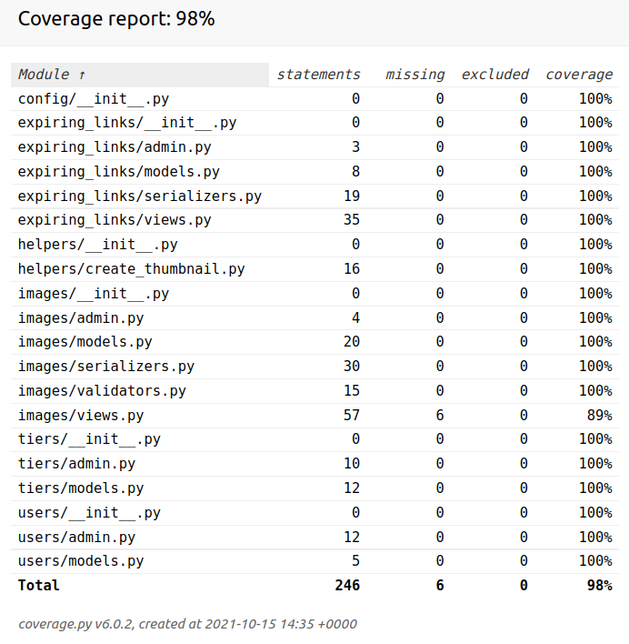

<h1 align="center">

Welcome to DRF Images Api 👋

</h1>


> REST API for storing and resizing images.
### 🏠 [Homepage]()
### ✨ [Demo](https://drf-images-api.herokuapp.com)
## Install
```sh
Requirements:
- Docker
- Docker-Compose
- Python 3.9

Make sure you have Docker and Docker-Compose installed on your device.
Rename and refill envs files (.env.db.dev-default => .env.db.dev and .env.dev-default => .env.dev).

For development app run command in your terminal:
docker-compose -f docker-compose.dev.yaml up --build

```

## Usage
```sh
API requires authentication, except for the expiring links.

You can log in as admin:
Admin panel: 'http://0.0.0.0:8000/admin/'

Swagger: 'http://0.0.0.0:8000/swagger/'
Redoc: 'http://0.0.0.0:8000/redoc/'

You can add fake initial data to your database:
docker-compose -f docker-compose.dev.yaml exec backend python manage.py runscript users_factory
docker-compose -f docker-compose.dev.yaml exec backend python manage.py runscript imagers_factory

Image list and create: 'http://0.0.0.0:8000/api/v1/images'
Thumbnails create: 'http://0.0.0.0:8000/api/v1/thumbnails'
Thumbnails list for given image: 'http://0.0.0.0:8000/api/v1/thumbnails/<image_id>'
Expiring link create: 'http://0.0.0.0:8000/api/v1/link'

Performance:
- Easy horizontal scaling using container orchestration (f.e. Kubernetes)
- We use Redis for caching
- We create thumbnails on demand

```



## Run tests
```sh
docker-compose -f docker-compose.dev.yaml exec backend pytest

```

## Author
👤 **Dominika Mazur**

* GitHub: https://github.com/DominikaMazur99
* LinkedIn: https://www.linkedin.com/in/dominika-mazur-43a602235/
* CodeWars: https://www.codewars.com/users/DominikaMazur99


## Show your support
Give a ⭐️ if this project helped you!
## Credits
**[Markdown Readme Generator](https://github.com/pedroermarinho/markdown-readme-generator)**


Copyright © 2021 [Patrick Piotrowski](https://github.com/DominikaMazur99 ).<br/>


---
_This README was created with the [markdown-readme-generator](https://github.com/pedroermarinho/markdown-readme-generator)_